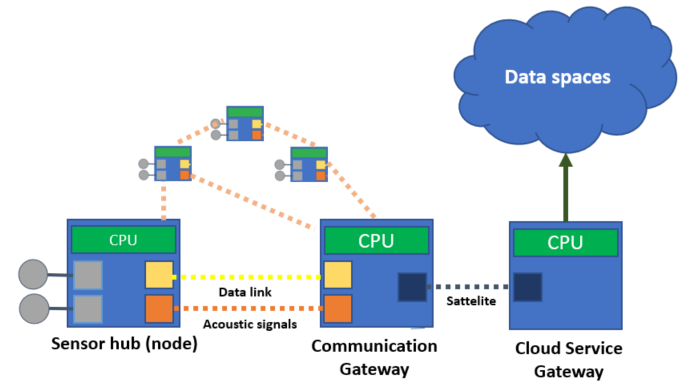

# Description
This repository contains the implementation for the course project for DAT351 Cloud and Distributed Resources for High Volume Data Processing at Høskulen på Vestlandet. 

The project aims to simulate a network of smart underwater sensors that can collect multiple marine parameters in real-time. Due to constraints regarding communication overhead, very little amount of data can be transmitted in the network. However, some important information (events) must be transmitted to central data management system for real-time decision-making. Another challenge to be addressed is how to distinguish between bad data and events. 

In this project, MapReduce on Hadoop is leveraged to realize the system. The topology of the system is illustrated below. 

Interested users and readers are redirected to [the report](final_report.pdf).
